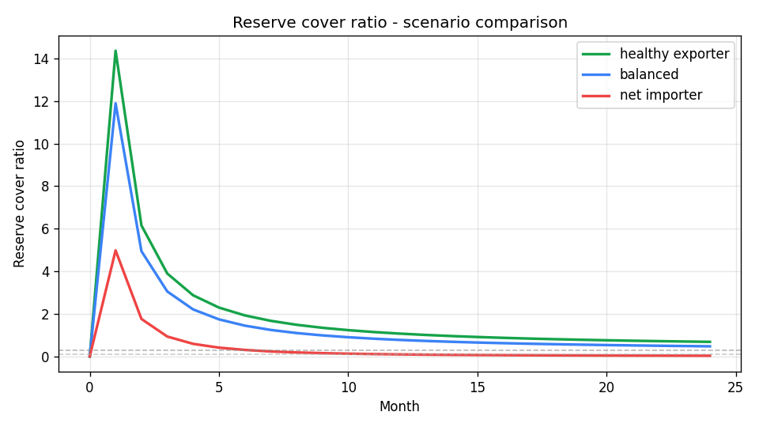
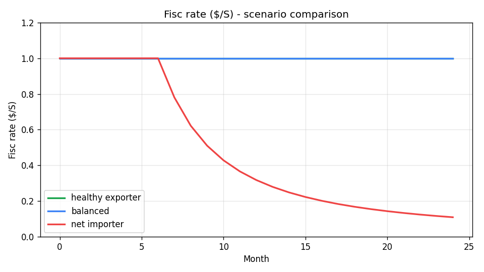
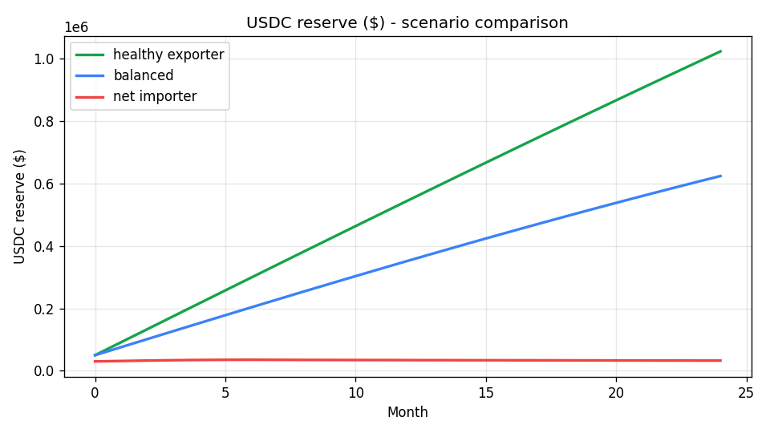
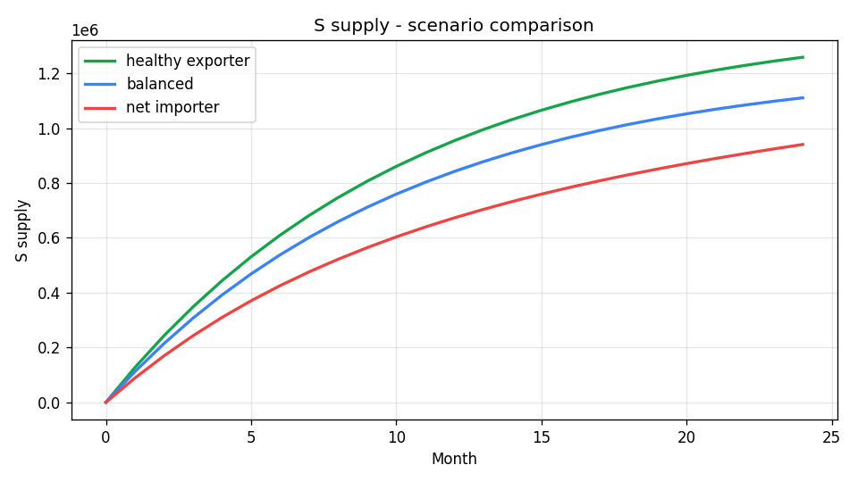

# SPICE Economy
## Unified specification — Mars and Earth colony models

*Version 2 — April 2026. Working document. Gaps are named explicitly.*

---

## Part 1 — Shared Foundations

Both Mars and Earth colonies run the same token model, the same company model, and the same constitutional protections. The differences are extensions, not replacements.

---

### 1.0 Participants

Four classes of natural person, four company officer roles, four institutions.

**Natural persons:**
- **Citizen** — adult holding one G-token. Receives monthly UBI, votes in colony governance, may hold V, equity, A-tokens.
- **Guardian** — adult citizen managing a child's wallet until age 18.
- **Founder** — citizen who deploys a colony or registers a company. No standing privileges except (for company founders) optional immediate-vest equity (§1.5).
- **Sole Trader** — citizen providing goods or services for S with no equity relationship.

**Company officers.** Every company has one Secretary. CEO, CFO, COO are optional. One person may hold all four roles (typical for sole-founder companies) or they may be distributed.
- **Secretary** — holds the company's O-token. Authorised to register the company, issue and forfeit equity, transfer assets, set officer roles.
- **CEO** — strategic direction; spokesperson.
- **CFO** — financial direction; declares dividends, manages V reserve.
- **COO** — operational direction; day-to-day ops, services, fulfilment.

**Institutions:**
- **MCC** — colony's essential-services provider. Citizen-elected CEO/CFO/COO board; commercial shareholders during their term. May not compete with private companies.
- **Company** — any registered enterprise; on-chain wallet, equity register, optional officer roles.
- **Fisc** — automated blockchain institution; mints, settles, registers. Not a person.
- **Protocol** — the layer above any single colony; runs the Colony Registry, collects protocol fees. See §1.8.

---

### 1.1 The Two Monetary Tokens

| | S-token | V-token |
|---|---|---|
| **Role** | Day-to-day spending. The current account. | Wealth, savings, dividends, asset values. The savings account. |
| **Issued by** | Fisc — monthly, to every citizen | Fisc — via S→V conversion, $→V import, company dividends |
| **Expires** | Yes — unspent S destroyed at month end | Never |
| **Scope** | Internal colony only. No external value. | Internal + external boundary (Earth only — see Part 3) |
| **Spending** | All day-to-day transactions | Via V→S redemption first, then spend as S |
| **Asset valuation** | No | Yes — all significant assets and liabilities valued in V |

**S expiry is the inflation control.** Fixed monthly mint, full destruction at month end. Money supply resets to zero each month. No policy override.

**Two tokens, two functions.** S forces velocity; V carries wealth. Citizens convert S surplus to V (capped). Companies convert net S earnings to V monthly.

---

### 1.2 The Three Governance and Identity Tokens

| Token | One per | Purpose | Economic value |
|---|---|---|---|
| **G** | Adult citizen | Governance — one vote in MCC elections, referenda, recall | None |
| **O** | Registered organisation | Identity — proves who speaks for the org on-chain | None |
| **A** | Any economic claim | Records every asset and liability in the colony | Yes — the claim itself |

**G-token:** soulbound. Non-transferable, non-purchasable, non-inheritable. Issued on signing the founding constitution at adulthood (18). Retired on death. Cannot be bought, sold, or delegated. One citizen, one vote, always.

**O-token:** held by the company secretary or MCC chair. Transfers to their successor when the role changes. Authorises on-chain operations for the organisation. No equity, no voting rights — pure identity.

**A-token:** the colony's unified economic claim. Every significant asset or liability is an A-token. Three forms:

1. **Unilateral asset** — physical object owned outright (robot, vehicle, land parcel). One A-token, one holder, no counterparty.
2. **Paired equity** — a company share. Fisc creates two simultaneously: asset A-token to the shareholder (records stake, receives dividends); liability A-token to the company (records aggregate distribution obligation). Fisc settles dividends automatically at month end.
3. **Paired fixed-obligation** — a bilateral payment agreement (loan, hire-purchase, instalment sale). Asset A-token to the creditor records the entitlement to receive payments; liability A-token to the obligor records the obligation to pay. Two variants: **unsecured** (subject to UBI cap) and **secured** (collateralised by a unilateral A-token escrowed for the term). Fisc settles each epoch automatically. Structural default is impossible for unsecured obligations — see §1.2a.

**Net worth:** V-tokens + S-tokens + Σ(positive A-token values) − Σ(liability A-token values).

**Registration threshold:** A-tokens required for assets above 500 S-equivalent in value, above 50 kg, or with autonomous AI capability. Below threshold, possession implies ownership.

---

### 1.2a Obligation Lifecycle

**Creation.** Either party drafts a proposal (counterparty, monthly amount, term, optional collateral). Both must sign within a fixed window. Unsigned proposals expire.

**Cap check.** For citizen obligors on unsecured obligations, the Fisc enforces:

```
Σ(existing unsecured monthly obligations) + new monthly amount  ≤  UBI
```

Proposals breaching the cap are rejected at the consent stage. Companies and secured obligations have no cap — collateral is the protection, escrowed for the term.

**Settlement** runs each epoch, before UBI mint:

| Obligor balance | Type | Action |
|---|---|---|
| ≥ monthly amount | any | Transfer S → creditor. Mark epoch paid. |
| < monthly amount | secured | Collateral → creditor. Default. |
| < monthly amount | unsecured | Missed payment recorded. (See §2.5 for Phase 2 enforcement.) |

**Completion.** Final epoch paid → both A-tokens deactivate, escrow releases.

**Forfeiture is not confiscation.** Secured default transfers consented collateral. Protection 11 (§1.7) prohibits seizure, not contractual forfeiture.

---

### 1.3 The Fisc

The Fisc is the colony's fully automated blockchain institution. Not a company. Not part of the MCC. A constitutional utility — created by the founding charter, governed by code not people.

**What the Fisc does:**
- Mints S-tokens on the 1st of each month — one fixed amount per registered citizen
- Destroys all unspent S-tokens at month end
- Processes S→V conversions (subject to colony cap rules)
- Processes V→S redemptions — uncapped, 1:1
- Settles all liability A-token obligations before crediting monthly UBI
- Settles MCC bills automatically from smart meter data
- Issues, transfers, and retires A-tokens — the sole creator of economic claim tokens
- Registers citizens, companies, assets, and share transfers
- Publishes all transaction data publicly
- Processes inheritance on registered death

**Fisc is not under MCC.** The body setting its own revenue cannot also issue currency.

**Only the Fisc mints.** No private entity creates S or V — no lending, debt issuance, or securitisation. Fractional reserve is constitutionally prohibited.

---

### 1.4 The MCC

The MCC (colony's essential services provider — named Mars Colony Company on Mars, may have any name on Earth) provides the services every citizen depends on that cannot safely be left to market competition.

- Provides essential shared services and bills in S-tokens
- The board comprises a CEO, CFO, and COO — commercial shareholders who own MCC during their term and receive profits as dividends
- Citizens hold G-tokens — governance rights only, not commercial ownership
- Board serves one-year terms, elected annually by G-token holders
- All MCC revenue, costs, and profit publicly visible on-chain in real time
- **Automatic recall trigger:** MCC bill rises >20% above 12-month rolling average in any single month — Fisc initiates colony-wide recall referendum automatically
- MCC may not compete commercially with private companies

---

### 1.5 The Company Model

Companies have no wages. This is not a constraint — it is the design.

- Any citizen may register a company with the Fisc (administrative registration, not a licence)
- Companies earn S from customers, pay suppliers and contractors in S
- At month end: all net S earnings convert to V. The CFO declares a dividend. Fisc distributes declared V pro-rata to all shareholders automatically.
- Participants hold vesting equity — monthly tranches over 1–12 months. Month-12 tranche is larger (commitment bonus). Unvested shares pay dividends but cannot be transferred. Unvested shares forfeited if participant leaves; vested shares are permanent.
- **Founder exception:** founders may receive equity that vests immediately at founding (no tranches). The only exception to the vesting requirement.
- One-off goods and services between parties are paid in S as commerce. This is trade, not employment.
- A **sole trader** is a citizen providing goods or services for S with no equity relationship. Accumulates wealth by converting S surplus to V.
- Companies fail if they cannot cover costs. No subsidy, no bailout.

**Share value:** floor = company V reserve × (shares held / total shares outstanding). Market price may exceed floor on growth expectations. Buybacks at market value; bought-back shares cancelled.

---

### 1.6 Citizenship

- Any person signs the founding constitution on-chain. Fisc issues G-token. UBI begins the 1st of the following month.
- No vetting, no fee, no approval process.
- Children registered by guardian at birth. Full UBI from birth, managed by guardian. G-token issued at 18 when the citizen signs the constitution themselves.
- By adulthood: a child whose guardian converted the monthly maximum to V holds at least 43,200 V-tokens — a capital foundation entirely their own.

---

### 1.7 Constitutional Protections

The following require 80% of all registered citizens to amend.

| # | Protection |
|---|---|
| 1 | UBI may not fall below the founding floor |
| 2 | UBI may not be conditional, means-tested, or withheld |
| 3 | Every adult citizen holds exactly one G-token |
| 4 | G-tokens cannot be bought, sold, or inherited |
| 5 | MCC may not compete commercially with private companies |
| 6 | Citizen V-tokens may not be confiscated by any authority |
| 7 | All ownership publicly visible on-chain at all times |
| 8 | MCC infrastructure may not be privatised |
| 9 | No licence required to register a company beyond Fisc registration |
| 10 | The Fisc may not be placed under MCC or company control |
| 11 | Citizen positive A-tokens may not be confiscated by any public or private authority |
| 12 | Only the Fisc may mint S or V tokens. Fractional reserve banking prohibited. |

---

### 1.8 Protocol Layer

A colony is one node in a global protocol.

- **Colony Registry.** A protocol-level registry records every colony. On registration, the Registry mints a soulbound non-transferable token to the colony itself — proof of identity, not ownership. Deregister and re-register operations are supported; the same token ID re-mints on re-registration.
- **Protocol fee.** Each colony pays a protocol fee on external settlement, denominated in the settlement asset (BTC/ETH on testnet). Split between protocol treasury and colony founder per a configurable ratio.
- **Founder share.** A permanent claim on the colony's external settlement activity. Default 25%; per-colony overrides set at founding. Held by a designated wallet, transferable between founders.
- **Constitutional independence.** No colony's MCC or citizenry has authority over the Registry. No protocol authority can override a colony's constitution.

---

## Part 2 — Mars Colony Economy

Mars is a closed economy. S and V have no value outside the colony. There is no external currency boundary. The economy is self-contained by design and by physical necessity.

---

### 2.1 S-Token — Mars

| Property | Value |
|---|---|
| Monthly UBI amount | 1,000 S per adult citizen — fixed |
| Expiry | All unspent S destroyed at month end |
| External value | None |
| Fractional reserve | Prohibited |
| Inflation | Impossible — see §1.3 |

**Fixed amount, no anchor.** S is closed-colony scrip. Value comes from what MCC and companies accept. The monthly reset is the complete inflation control; prices clear within the fixed monthly budget.

---

### 2.2 V-Token — Mars

| Property | Value |
|---|---|
| Monthly citizen conversion cap | 200 S → V per citizen per month |
| Company conversion | All net monthly S earnings → V (uncapped) |
| Expiry | 100 years from mint date (prevents dynastic accumulation across generations) |
| External value | None |
| Redemption | V → S at 1:1, uncapped, at any time |

**Citizen cap is a founding-phase protection.** Uncapped conversion in a small colony would let a handful dominate before competition develops. Relaxable by referendum.

---

### 2.3 Land — Mars (Harberger)

Land parcels are A-tokens. On Mars, surface land is unowned at founding. The Fisc operates Harberger stewardship:
- Owner declares a V-token value
- Monthly stewardship fee: 0.5% of declared value in V, paid to colony treasury
- Any citizen or company may force-purchase at the declared price at any time — the owner cannot refuse
- Self-correcting: price too high → expensive fee. Price too low → immediate purchase. Honest pricing is the equilibrium.
- First registration: first-come-first-served by declaring a value and paying the first month's fee.

---

### 2.4 What MCC Provides on Mars

Atmosphere, water, power, habitat, food baseline, medical AI, communications, waste processing, security. Billed in S at metered rates via smart contracts. Citizens see their real-time bill on-chain at any moment.

---

### 2.5 Known Gaps — Mars

| Gap | Status |
|---|---|
| Inter-colony trade | Phase 2 — instrument will be BTC or equivalent. Not in scope here. |
| Colony exit | Phase 2 — V-tokens are non-portable. Exit mechanism via external settlement not yet designed. |
| V cap relaxation schedule | Open — at what colony size or maturity does the 200/month cap become counterproductive? |
| UBI floor adjustments | Open — the founding UBI is fixed. What is the mechanism for a colony-wide vote to raise it? |
| Multiple colonies, one Fisc | Open — do colonies share a Fisc instance or run independent instances? |
| Unsecured obligation enforcement | Open — if an obligor empties their S balance before settlement, the missed payment is recorded but no recovery is taken. Phase 2: V-token attachment, late fees, public delinquency record, or contractual remedies. |

---

## Part 3 — Earth Colony Economy

Earth is an open economy. A dollar boundary exists. S remains purely internal. V is the bridge between the colony economy and the external dollar world.

Everything in Parts 1 and 2 applies to Earth with the following extensions and differences.

---

### 3.1 S-Token — Earth

Same as Mars. UBI amount set at colony founding. Expires monthly. Internal only. No change.

---

### 3.2 V-Token — Earth

| Property | Mars | Earth |
|---|---|---|
| Citizen conversion cap | 200 S/month | **None — uncapped** |
| Dollar imports | Not applicable | **$ → V at Fisc rate** |
| External conversion | None | **V ↔ $ at Fisc rate (two-way)** |
| Asset valuation | V | V (same) |
| Expiry | 100 years | 100 years (same) |

**No cap on Earth.** Wealth arrives from outside in V (dollar imports, asset valuations, dividends). A cap would penalise asset-poor citizens with room to save while constraining the asset-rich arbitrarily.

**Dollar imports → V, not S.** S is the monthly spending layer and expires. Capital entering from outside belongs in V, the permanent layer.

---

### 3.3 The Fisc Rate and Dollar Boundary

The Fisc rate ($/V) is set so the colony's reference basket always costs a fixed number of V-tokens. As automation drives goods prices down, the Fisc rate falls — but the basket cost in V remains stable. Citizens think in V, not in dollars.

**Dollar import ($ → V):**
1. Citizen or company brings dollars to the Fisc
2. Fisc mints V at the current Fisc rate
3. Fisc immediately converts received dollars to BTC (or gold) — not held as dollars
4. The V is fully backed by hard assets in the reserve

**Dollar export (V → $):**
1. Citizen or company requests dollar redemption
2. Fisc sells BTC from reserve at market price
3. Pays out dollars at current Fisc rate
4. Burns the redeemed V

**BTC, not dollars, in the reserve.** Dollar debasement is the premise of the Earth model. Dollar-backed V erodes with the currency. BTC appreciates as the dollar weakens — the reserve strengthens as conditions deteriorate.

**Two-way conversion is required for adoption.** A one-way street feels like a trap. The reserve must be sized to honour redemptions — see §3.10.

---

### 3.4 The Fisc Reserve

The Fisc reserve is the colony's hard-asset backing for all V-tokens issued via dollar import. It does not back UBI-minted V (which is ex nihilo, like the S-token mint).

| Reserve property | Detail |
|---|---|
| Assets held | BTC (primary), gold (secondary) |
| Funded by | Dollar imports from purchase scheme |
| Purpose | Back two-way V↔$ conversion |
| Appreciation | As dollar weakens, BTC reserve appreciates — reserve strengthens |
| Managed by | Fisc autonomously — no board discretion |

The reserve is publicly visible on-chain at all times. Any citizen can verify the backing ratio.

---

### 3.5 Asset and Liability Valuation

The Fisc offers on-chain denomination of any asset or liability in V-tokens.

- Bring any asset (property, business, equipment) or liability (mortgage, loan)
- Provide current dollar market value (self-reported, or evidenced by market transaction)
- Fisc records: asset ID, V value at current Fisc rate, timestamp
- Valuation **floats** — updates as dollar price and Fisc rate change
- Asset is now in the colony ecosystem: tradeable in V, usable as collateral, visible on ledger

**Floating, not fixed.** A fixed valuation is a hedge. A floating valuation is a denomination service — it brings the asset inside the V economy without promising future dollar value. Citizens who want to hedge should hold V, not fix asset valuations.

**Liability standoff:** debtors do not want their liabilities S-valued (they prefer dollar debt to inflate away). Creditors do. Resolved by original contract terms or negotiation. The Fisc will register either party's position — it does not adjudicate the dispute.

**Land on Earth:** pre-existing private property. A-tokens issued at founding to reflect existing ownership. Transfers by mutual agreement at freely negotiated prices. No Harberger mechanism unless the founding constitution explicitly adopts it.

---

### 3.6 Corporate SPICE Supporters

External companies — national chains, regional employers — may voluntarily register as SPICE supporters. The agreement:
- Accept S-tokens as payment within the colony boundary
- Optionally: pay a voluntary LAT (Local Automation Tax) on declared automation profits, distributed as additional UBI via the Fisc
- In return: recognised as colony participants, listed on-chain, access to the S-token customer base

**LAT is opt-in.** The colony has no legislative authority for compulsory taxation. Companies sign because their customer base has UBI; participation is a commercial decision, not charity.

---

### 3.7 What MCC Provides on Earth

The MCC on Earth provides whatever essential shared services the colony depends on. Examples:

| Colony type | MCC services |
|---|---|
| University campus | Canteen access, printing, space hire, student services |
| Housing cooperative | Utilities, maintenance, shared facilities |
| Tech campus | Employee services, gym, childcare, canteen |
| Town pilot | Local services agreed by founding merchants and residents |

The MCC handles external purchasing (flour, equipment, utilities) in dollars centrally. Individual colony businesses receive S and never touch external suppliers directly. The dollar/S boundary is managed at the institutional level, invisibly to participants.

---

### 3.8 The Two Kinds of S in Circulation

Two sources of S, naturally segmenting by use without any policy rule:

| | UBI-minted S | Purchase-minted S (via V redemption) |
|---|---|---|
| Origin | Fisc monthly mint | V→S redemption by citizens with dollar-imported V |
| Backing | None — sovereign money | BTC reserve (indirectly, via V) |
| Inflation effect | Mild, predictable, fixed formula | None — backed by reserve |
| Typical transaction | Groceries, services, daily needs | Large purchases after V→S redemption |
| Velocity | High | Low |

The colony's S economy is dominated by UBI-minted S in daily circulation. Purchase-minted S (redeemed from dollar-imported V) appears only when someone converts wealth for a specific large transaction.

---

### 3.9 The Flipping Point

Earth has a transition dynamic Mars does not: a gradual shift from dollar to V as reference currency.

- **Pre-flip:** assets quoted in $; V value derived.
- **Post-flip:** assets quoted in V; $ value irrelevant or unavailable.

The flip is not decreed — it happens when enough liquidity sits in V that buyers and sellers naturally quote there. The Fisc valuation service, the purchase scheme, and dollar collapse all accelerate it.

---

### 3.10 Known Gaps — Earth

| Gap | Status |
|---|---|
| Reserve ratio | What minimum BTC reserve is required to honour redemptions? No floor set. |
| Redemption gates | If redemption demand exceeds reserve, what happens? No limit or delay mechanism designed. |
| Fisc rate mechanism | Who sets the reference basket? How is the rate updated? Frequency? Oracle? |
| Corporate LAT auditing | Voluntary LAT requires a declared automation profit figure. Who verifies it? |
| Transition period LAT | During partial automation, LAT on windfall is conceptually valid but operationally complex. Left open. |
| Earth Lite | A middle-ground model between campus (fully closed, institution as Fisc) and full Earth (open, BTC reserve, Collision-ready) is referenced but not yet specified. |
| Inter-colony trade | Same as Mars — Phase 2. BTC settlement between colonies not yet designed. |
| Regulatory environment | S-tokens and V-tokens are not legally recognised currencies. No legal framework for the Fisc valuation service. Tax treatment of V gains unclear. All open. |
| Dollar collapse timing | The Earth model is designed for a Collision that may or may not occur on any given timeline. The colony must be viable without the Collision as well as with it. |

---

## Summary — Mars vs Earth

| | Mars | Earth |
|---|---|---|
| Economy type | Closed | Open — $ boundary |
| S UBI amount | Fixed (e.g. 1,000/month) | Fixed (set at founding) |
| S expiry | Monthly | Monthly |
| V citizen cap | 200 S/month | None |
| V external value | None | Two-way V↔$ at Fisc rate |
| Dollar imports | Not applicable | $ → V, Fisc buys BTC |
| Asset valuation | V | V (same) |
| Land | Harberger stewardship | Pre-existing private property |
| LAT | Not applicable | Voluntary opt-in only |
| BTC reserve | Not applicable | Yes — backs V↔$ conversion |
| Collapse dependency | No — self-contained | No — viable before and after Collision |

---

## Part 4 — Model Results

A 24-month deterministic simulation of an Earth colony — 1,000 citizens,
50 companies, monthly tick — to test whether the design is self-sustaining
and to identify the failure mode.

The model is in `docs/economy-model/model.py`. Three scenarios are run with
identical default behaviour, varying only the colony's external trade
position: a healthy net exporter, a balanced colony, and a net importer.

### 4.1 Method

Each month the model executes, in order:

1. **UBI mint** — MCC issues new S to citizens (95% claim rate)
2. **Citizens spend** — 85% of held S, distributed across companies and P2P
3. **Companies pay wages** — 50% of revenue back to citizens
4. **Companies pay MCC bills** — 5% of revenue
5. **S → V conversions** — 10% of company revenue, 5% of citizen S, locked into V-reserve
6. **Citizen cashouts** — a fraction of citizens convert V → USDC at the current Fisc rate
7. **Exports** — large companies' USD revenue is deposited at Fisc; new S minted at the prevailing rate
8. **LAT** — voluntary contribution from participating exporters into the reserve
9. **Dividends** — V dividend declared from company V-reserve to citizen shareholders
10. **MCC consumes** — 80% of collected S spent on services (treated as removed from supply)
11. **Fisc rate update** — if reserve cover ratio < 30% target, rate compresses linearly toward zero

### 4.2 Scenarios

| Parameter | Healthy exporter | Balanced | Net importer |
|---|---|---|---|
| Large companies (exporters) | 5 | 5 | **1** |
| Export USD per large co/month | $8,000 | $5,000 | **$1,500** |
| LAT participation | 80% | 60% | **20%** |
| Citizen cashout rate / month | 1% | 2% | **5%** |
| Citizen cashout fraction (of V) | 30% | 30% | **50%** |
| Initial USDC reserve | $50,000 | $50,000 | **$30,000** |

Everything else (1,000 citizens, $100/month UBI, 95% UBI claim, 30% reserve target) is held constant.

### 4.3 Results — 24 months

| Metric | Healthy exporter | Balanced | Net importer |
|---|---:|---:|---:|
| End S supply | 1,258,455 | 1,110,431 | 940,300 |
| End V supply | 1,494,597 | 1,313,901 | 992,070 |
| End USDC reserve | $1,023,626 | $624,208 | **$32,578** |
| End Fisc rate ($/S) | 1.00 | 1.00 | **0.11** |
| End cover ratio | 0.685 | 0.475 | **0.033** |
| Total UBI minted (24mo) | 2,280,000 S | 2,280,000 S | 2,280,000 S |
| Total exports (24mo) | $960,000 | $600,000 | **$36,000** |
| Total cashouts (24mo) | $24,774 | $43,792 | $33,782 |
| Net USD inflow | $973,626 | $574,208 | **$2,578** |
| Fisc rate first dip | never | never | **month 7** |
| Reserve floor breach | never | never | **month 12** |

### 4.4 Charts









### 4.5 Findings

**The peg's life depends on net USD inflow, not S volume.** All three scenarios
mint identical UBI ($2.28m S over 24 months) and run identical citizen
behaviour. What separates a thriving colony from a failing one is the
USDC entering through the Fisc — exports plus LAT contributions — minus
the USDC leaving through citizen cashouts. The healthy and balanced
colonies hold the peg flat at $1 the whole way. The net importer holds
it for six months while the seed reserve drains, then the peg compresses
hard from month 7 onward, ending at 11¢ on the dollar.

**The system is structurally honest.** When the reserve runs low, the Fisc
rate falls; citizens still holding V take a real loss measured in USD.
There's no hidden mechanism propping it up, no debt issuance, no
counterparty taking the loss. The asset-side and liability-side numbers
match by construction.

**Reserve cover ratio is the leading indicator, not the lagging one.** In
the failing scenario, by month 7 the reserve has already dropped to ~25%
of the V supply (below the 30% target), even though the rate is still
$1.00. From there the rate compression is locked in. Earlier action — e.g.
inviting new exporters, bumping LAT, capping citizen cashout — would
have to start before month 6 to be effective.

**LAT is not a marginal sweetener; it's structurally important.** Dropping
LAT participation from 60% (balanced) to 20% (net importer) removes
roughly $17,640 of cumulative reserve top-up over 24 months. That's
1.5× the entire seed reserve of the failing colony. A small voluntary
contribution from the colony's biggest exporters has outsized effect on
the peg's durability.

**For the colony designer:** the practical question at colony founding is
*"how much external revenue per citizen per month, sustained, do we need
to defend a peg?"* In this model, with default behaviour, a colony of
1,000 citizens needs roughly **$3-4/citizen/month of net USD inflow** to
hold the peg comfortably. A colony that can't realistically project at
least that much external earnings should consider either (a) a Mars-style
closed economy with no $ peg, or (b) a lower UBI and slower V
accumulation to reduce the redemption liability.

### 4.6 Caveats

- The model is **deterministic**. Real colonies experience shocks (export
  collapse, cashout panic). Stochastic variants are a future extension.
- Citizen and company behaviour parameters are **defensible defaults, not
  measured** — they should be tuned against any real data we collect from
  Dave's Colony usage.
- **MCC operations are simplified** — collected S is treated as consumed,
  not as wages re-paid to MCC employees. Re-circulation of MCC S would
  slightly increase money velocity and citizen income.
- The model does **not yet handle**: company-to-company supply chains,
  asset-token (A-token) economic flow, intra-month obligations, or
  dividend reinvestment.

---

*SPICE Economy · Unified Specification · v3 · April 2026*
*v3 changes (29 April 2026): Added Part 4 — Model Results. 24-month deterministic simulation across three scenarios. Model code at docs/economy-model/model.py.*
*v2 changes: trimmed verbose "Why" paragraphs throughout. Added §1.0 Participants, §1.2a Obligation Lifecycle, §1.8 Protocol Layer, founder vesting carve-out.*
*Supersedes: mars_colony_economy.md (economic model sections). mars_colony_economy.md remains the reference for operational detail (robot fleet, founding colony, frontier stories).*
